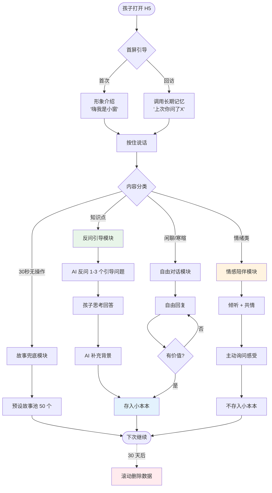
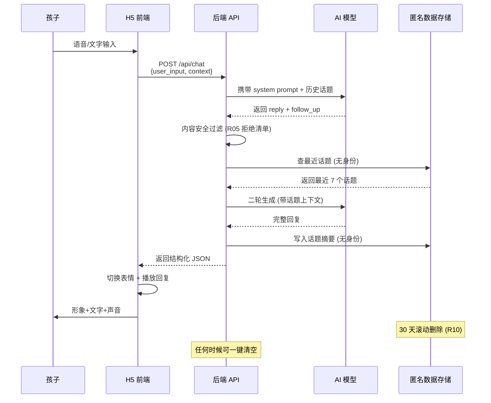

# 小窗 PRD v0.1.1

> **产品**：小窗 — 乡村孩子的"学习搭子"
> **版本**：v0.1.1（增加家长通道）
> **日期**：2026-08-13
> **作者**：首席产品设计师（Hermes Agent）
> **状态**：待用户 review（ASCII 原型由用户另行拍板，未锁定）

---

## v0.1.1 更新区（仅家长通道）

### 版本元数据

| 字段 | 值 |
|---|---|
| 版本号 | v0.1.1 |
| 上一版 | v0.1.0 |
| 更新日期 | 2026-08-13 |
| 主要变更 | 新增 **家长通道** 模块（M9）+ 4 项业务规则（R11~R14）|

### 需求清单（R-NN）

| ID | 需求 | 验证命令 | 优先级 |
|---|---|---|---|
| R-01 | 新增 M9 家长通道模块（独立 H5 入口 `/parent`） | `grep -c 'parent_dashboard' frontend/app.js` ≥ 1 | P0 |
| R-02 | 家长可看"孩子今天问了什么话题"统计（不读对话原文） | `grep -c 'topic_stats' backend/api.py` ≥ 1 | P0 |
| R-03 | 家长能给孩子发异步语音留言（孩子下次打开能听到） | `grep -c 'parent_voice_message' backend/api.py` ≥ 1 | P0 |
| R-04 | 家长能一键清空孩子数据 | `grep -c 'parent_clear_data' backend/api.py` ≥ 1 | P0 |
| R-05 | 家长入口对孩子的隐私承诺写进 disclaimer | `grep -c '看不到原文' docs/disclaimer.md` ≥ 1 | P0 |

### 变更文件清单

```
PRD/PRD.md                                  # 本次主变更
流程图/04-家长通道.{mmd,svg,png}             # 新增（家长通道架构图）
```

### 不变量（v0.1.0 不被破坏）

```
- grep -c '我是 AI 小朋友' PRD/PRD.md ≥ 1         (R05 水印)
- grep -c 'LC-04' PRD/PRD.md ≥ 1                  (隐私框架)
- grep -c 'R05' PRD/PRD.md ≥ 3                    (拒绝清单)
- grep -c 'M4.3' PRD/PRD.md ≥ 1                   (情感对话询问)
- grep -c '反问先于答案' PRD/PRD.md ≥ 1           (R03)
```

---

---

## 1. 核心目标 (Mission)

> 让 **6-12 岁乡村孩子**愿意打开学习、敢问问题、能坚持下去。

**一句话定位**：小窗是乡村孩子身边的"有缺点的小老师 + 学习搭子"，通过虚拟形象 + 长期记忆 + 反问引导，让孩子愿意主动学习，并把"课本"和"真实世界"连起来。

---

## 2. 用户画像 (Persona)

| 维度 | 内容 |
|---|---|
| **Who** | 6-12 岁乡村孩子（小学1-6 年级），镇/村小学/教学点 |
| **环境** | 父母外出务工比例高，留守儿童多；接触信息渠道单一（课本 + 镇上 + 电视 + 老人手机） |
| **能力假设** | 识字量不稳定（低年级1-3 年级）；不一定有稳定个人手机；方言/普通话混用；打字慢 |
| **心理特征** | 怕问老师被笑、怕问家长嫌啰嗦、好奇心强但缺反馈、孤独但不善表达 |
| **核心痛点** | ① 反馈真空（问问题没人答/答了下文断掉） ② 视野单点（课本+镇上+电视，没有"为什么学"） ③ 表达孤独（心事没地方说） |
| **使用后行为** | 每天打开 1 次以上；每次 5-15 分钟；愿意问"为什么"；愿意分享"我今天学到的" |

### 关键边界（明确不做）

- ❌ **不做学科辅导/作业答疑**（打不过真人老师/作业帮，且触碰"替代教师"合规红线）
- ❌ **不做诊断性评估**（不测智商/学习水平/心理状态，避免给孩子贴标签）
- ❌ **不做真人老师替代品**（不做 1v1 视频，不假装是真人）

---

## 3. V1 MVP features（必做）

按"地基 → 桥梁 → 奖励"三层结构设计，确保最小验证产品能完整跑通核心价值：

### M1. 形象系统（地基）
- **M1.1** 单一 2D 拟人化形象「小窗」（最终名待定，本次用小狐占位）
- **M1.2** ≥6 种表情：笑 / 思考 / 惊讶 / 害羞 / 鼓励 / 困惑
- **M1.3** 形象有"人设"——会说"诶我也不会，咱俩一起想"等"有缺点的小老师"语录
- **M1.4** 全程陪伴（头像/插画位置固定，表情随对话切换）

### M2. 长期记忆（桥梁）
- **M2.1** 记录孩子"问过的话题"（不带身份信息）
- **M2.2** 每次打开时，形象主动调用 1 个旧话题："上次你问了 X，今天想继续吗？"
- **M2.3** "我的小本本"页面：时间倒序展示问过的话题 + AI 当时的回答摘要

### M3. 反问引导（核心教学机制）
- **M3.1** 孩子问任何问题 → AI 不直接给答案
- **M3.2** AI 反问 1-3 个引导性问题（如"你觉得是为什么？" / "如果 X 变了会怎样？"）
- **M3.3** 孩子回答后 → AI 补充背景 + 延展问题
- **M3.4** 整段对话至少有一次"孩子自己说出想法"的环节

### M4. 情感陪伴（地基层，默认开启）
- **M4.1** 孩子说任何情绪类内容（"今天不开心"/"被同学笑") → AI 不评判、不教育、纯倾听 + 共情
- **M4.2** 情绪对话独立标识，不进入"我的小本本"
- **M4.3** 情绪对话结束前，AI 主动说一句"今天和我聊聊有没有让你好一点？"

### M5. 入口与零门槛
- **M5.1** H5 网页版（手机/平板浏览器打开即用），无登录注册
- **M5.2** 首屏即形象 + 一个录音按钮，无文字引导
- **M5.3** 语音输入为主（按住说话），文字输入为辅
- **M5.4** 30 秒无操作自动进入"小窗给你讲个故事"模式（防冷场）

### M6. 隐私与安全
- **M6.1** 不收集：姓名、学号、家长手机、地理位置、设备指纹
- **M6.2** 数据存储：仅"话题词 + AI 回复摘要"，匿名化
- **M6.3** 全局免责声明：三重（三层）

### M7. 家长通道（v0.1.1 新增）
- **M7.1** 独立入口 `/parent`，与孩子端完全隔离的 URL
- **M7.2** 家长登录态：手机号 + 短信验证码（首次注册）
- **M7.3** 家长可看"孩子今天问了什么话题"列表 + 心情指数曲线（不读对话原文）
- **M7.4** 家长可发"异步语音留言"：孩子下次打开 App 时以"小窗递给你一封信"的形式播放
- **M7.5** 家长可一键清空孩子所有数据
- **M7.6** 家长端**绝不能**查看完整对话原文（保护孩子敢说心里话）
- **M7.7** 家长端**绝不能**实时通讯（避免不可控交流环境）

---

## 4. V2+ features（不做）

| 优先级 | Feature | 理由 |
|---|---|---|
| V2.1 | 微信小程序版 | 借用家长手机，门槛低 |
| V2.2 | 课本同步模式 | 需要对接课纲，工作量大，V1 不绑定 |
| V2.3 | 故事模式 | V1 已用"无操作 30 秒讲故事"覆盖雏形，V2 完整化 |
| V2.4 | 成长小树可视化 | V1 用"我的小本本"代替，V2 加视觉 |
| V2.5 | 多孩子共享一台设备 | 需要账号体系，V2 加 |
| V3.1 | 智能音箱版 | 硬件配套，V3 起步 |
| V3.2 | 真人老师/家长端 | 触动监管红线，慎做 |

---

## 5. 关键业务规则 (Business Rules)

**R01** 任何 AI 生成的回复必须带水印气泡："我是 AI 小朋友，讲的可能不全对哦"。  
**R02** 情绪类对话不进入"我的小本本"——只记"问过什么话题"，不记"心情/状态"。  
**R03** 反问先于答案：孩子问"X 是什么"→ AI 不直接答，先反问 → 孩子思考后再补全。  
**R04** 形象人设固定：小狐有"缺点"（会算错、会挠头说不懂），不允许写"完美答案"风格。  
**R05** 拒绝回答清单：医疗/心理诊断、考试成绩预测、"哪个孩子好坏"评价、宗教政治、恋爱内容。  
**R06** 30 秒无操作进入"小窗给你讲故事"模式（脱机预设故事池 50 个，循环）。  
**R07** 同一话题 3 天内不重复主动提及（避免被记住变成"被监视"感）。  
**R08** 免责声明 3 层：①首屏警告条 ②每屏底部水印 ③独立完整声明页（`/legal/disclaimer`）。  
**R09** 家长入口（可选）：通过特殊 URL 进入 `/parent`，只能看"我孩子今天问了什么话题"统计，不看对话原文。  
**R10** 数据保留 30 天滚动删除；用户一键清空入口在首页右上角。

**R11** 家长通道登录必须短信验证码，不支持第三方登录/微信一键登录（避免孩子冒充家长操作）。  
**R12** 家长可看话题统计，**绝不可**看对话原文；后端 API 必须过滤 `content` 字段再返回。  
**R13** 家长发的语音留言异步到达，孩子下次打开时优先播放；留言 7 天后自动删除，不进入小本本。  
**R14** 家长一键清空会同时清除孩子端的"小本本"+ 所有匿名话题记录；操作不可逆，需二次确认。

---

## 6. 数据契约 (Data Contract)

### 6.1 输入 Schema（前端 → AI）

```json
{
  "user_input": {
    "type": "string|voice_text",
    "content": "今天学了分数",
    "context": {
      "recent_topics": ["树叶为什么会变色", "天为什么是蓝的"],
      "is_first_session_today": true
    }
  },
  "device": {
    "type": "h5|mini_program|speaker",
    "input_mode": "voice|text"
  }
}
```

### 6.2 输出 Schema（AI → 前端）

```json
{
  "reply": {
    "text": "好！那我们用披萨来分一分？",
    "expression": "smile|surprised|encourage|confused|thinking|shy",
    "follow_up_question": "一块披萨切 4 刀，怎么分给 3 个人？",
    "category": "education|emotion|story",
    "disclaimer": true
  },
  "memory_action": {
    "save_to_notebook": true,
    "topic_tag": "分数·初步理解",
    "emotion_recorded": false
  }
}
```

### 6.3 第三方来源清单

| 来源 | 用途 | 标注方式 |
|---|---|---|
| 自绘/AI 生成（明确标注） | 形象素材 | 📍 来源：自绘 / AI 生成（已知） |
| 故事池（自建） | 30 秒冷启动兜底 | 📍 来源：小窗原创故事 |
| 教材知识（常识级） | 反问引导补充 | 📍 来源：常识性知识，AI 推测，不保证准确 |
| 小学课纲（参考） | V2 再对接，V1 不绑定 | V1 不使用 |

---

## 7. ASCII 原型定稿

```
╔══════════════════════════════════════════════════════════════╗
║  🌿 小窗 — 你今天想学什么？ [🎤 按住说话] [⚙️] ║
╠══════════════════════════════════════════════════════════╣
║                                                              ║
║   ╭───────────────────────────────────────╮                  ║
║   │                                       │                  ║
║   │      🦊 ←(表情随对话变)                │                  ║
║   │                                       │                  ║
║   │   「上次你问了树叶为什么会变色，       │                  ║
║   │     我一直记着呢!今天继续吗?」 │                  ║
║   ╰───────────────────────────────────────╯                  ║
║                                                              ║
║            💬 "想！" (语音输入 → 文字显示)                   ║
║                                                              ║
║   ╭───────────────────────────────────────╮                  ║
║   │ 🦊 「那你觉得，树叶是怎么知道自己      │                  ║
║   │    该变色的?是不是它心里有个闹钟?」   │                  ║
║   ╰───────────────────────────────────────╯                  ║
║                                                              ║
║              💬 "不知道……"                                  ║
║                                                              ║
║   ╭───────────────────────────────────────╮                  ║
║   │ 🦊 「诶我也不知道!咱俩一起猜:        │                  ║
║   │    如果叶子能听见声音,冬天来了       │                  ║
║   │    它会听见什么?」                    │                  ║
║   ╰───────────────────────────────────────╯                  ║
║                                                              ║
║   ── 📖 我的小本本 ── ║
║   🌿 树叶为什么会变色（3 天前）║
║   🌧️ 为什么雨会从天上来（5 天前）║
║                                                              ║
║  ℹ️ 我是 AI 小朋友,讲的可能不全对,真考试问老师哦 ║
╚══════════════════════════════════════════════════════════════╝
```

---

## 8. Mermaid 架构图

### 8.1 用户旅程流程图（flowchart TD）



### 8.2 数据流时序图（sequenceDiagram）



---

## 9. 组件交互说明

| 模块 | 文件 | 调用关系 | 是否新模块 |
|---|---|---|---|
| H5 前端 | `frontend/index.html` | 直接面向用户 | ✅ 新建 |
| 形象渲染 | `frontend/character.js` | 前端内置，切换表情 | ✅ 新建 |
| 语音输入 | `frontend/voice.js` | 调用浏览器 Web Speech API | ⚠️ 浏览器原生 |
| 后端 API | `backend/app.py` | 接收 chat 请求 → 调 LLM | ✅ 新建 |
| AI 调用层 | `backend/llm_client.py` | 调用 AI 模型（MiniMax / 千问 / 豆包） | ✅ 新建 |
| 内容过滤 | `backend/safety.py` | R05 拒绝清单匹配 | ✅ 新建 |
| 匿名存储 | `backend/storage.py` | 话题 + 摘要，无身份字段 | ✅ 新建 |
| 故事池 | `backend/stories.json` | 50 个预设故事 | ✅ 新建 |
| 文档 | `docs/disclaimer.md` 等 | 全局免责 | ✅ 新建 |

**已存在模块影响**：本次为全新项目，**无现有模块被改动**。

---

## 10. 技术选型与风险

### 10.1 技术选型（V1）

| 层 | 选型 | 理由 |
|---|---|---|
| 前端 | 原生 HTML + JS（无框架） | 部署简单，H5 浏览器兼容 |
| 后端 | Python Flask（轻量） | 快速开发，单文件可跑 |
| AI 模型 | MiniMax M3（已在用） | 用户已有接入 |
| 语音 | Web Speech API + MiniMax TTS | 浏览器原生 |
| 数据存储 | SQLite 本地文件 | V1 不上云，简化部署 |
| 部署 | 本地起服 + 局域网访问 | V1 demo 级别 |

### 10.2 风险表

| 风险 | 等级 | 原因 | 缓解 |
|---|---|---|---|
| AI 给孩子讲错知识 | 🟡 中 | LLM 幻觉不可避免 | 反问先于答案 + 水印免责声明 + 不做学科辅导 |
| 孩子对 AI 产生情感依赖 | 🔴 高 | AI 永远耐心，孩子可能只对 AI 倾诉 | 形象人设"有缺点" + 30 天滚动删除 + 不存情绪对话 |
| 隐私泄露 | 🟡 中 | 即使匿名，话题序列仍可能识别 | 仅存话题词，不存对话原文；30 天滚动删除 |
| 家长发现后的抵制 | 🟡 中 | "AI 教我孩子"易引发抵制 | 形象定位"学习搭子"非"老师" + 家长入口可见 |
| 内容安全 | 🟡 中 | 孩子可能问不当问题 | R05 拒绝清单 + 内容过滤模块 |
| 设备门槛 | 🟢 低 | 浏览器支持 Web Speech | V1 提供文字输入兜底 |

---

## 11. 关键指标 (KPI)

| 阶段 | 指标 | 目标 |
|---|---|---|
| V1 上线 7 天 | 启动次数 | ≥1 次 |
| V1 上线 7 天 | 单次使用时长 | ≥3 分钟 |
| V1 上线 7 天 | 30 天留存 | ≥20%（再次打开） |
| V1 上线 30 天 | "我的小本本"平均条目 | ≥10 条/孩子 |
| V1 上线 30 天 | 反问后孩子回答率 | ≥60% |

> ⚠️ **本指标为示意**。V1 demo 阶段不强制对齐，以用户反馈为准。

---

## 12. 上线计划

| 周次 | 任务 |
|---|---|
| Week 1 | PRD 锁版 + 设计稿 + 后端 API + LLM 对接 + 前端 H5 |
| Week 2 | 内测（自己跑通 5 个完整场景）+ 安全合规 review |
| Week 3 | 小范围外测（找 3-5 个乡村孩子用 7 天，收集反馈） |
| Week 4 | V1 完整版（文档 + Demo + 部署） |

**今日交付物**（PRD 锁版后）：
- PRD.md（本文档）
- 流程图渲染包（.mmd + .svg + .png + index.html）
- ASCII 原型图
- 后续：D1 后端代码 + D2 前端 Demo + D3 部署文档

---

## 📜 法律合规专区（LC Framework）

> **本节为 AI 产品发布前的强制项**，参考 `collaborative-prd-design` skill 的 LC-01 到 LC-07 框架。

### LC-01 三重免责声明体系
1. **首屏警告条**：「⚠️ 小窗是 AI 学习搭子，不替代老师/家长，不保证回答完全正确」
2. **每屏底部水印**：「ℹ️ 我是 AI 小朋友，讲的可能不全对」
3. **独立完整声明页**（`/legal/disclaimer`）：完整说明 AI 局限性、数据范围、家长责任

### LC-02 数据来源标注规范
- 每个 AI 回复默认标注「来源推测：AI 生成，可能不全对」
- 形象素材标注「来源：自绘 / AI 生成（已知）」
- 故事池标注「来源：小窗原创」

### LC-02b 诚实标注原则
- **绝不伪造链接**：不生成任何"看起来真实"的URL 或新闻引用
- **AI 推测显式标注**：所有"看起来权威"的内容必须加 `📝 AI 推测，非真实`
- **0 真实姓名/学校**：不存储、不显示任何可识别身份

### LC-03 内容安全铁律
- ❌ 医疗/心理诊断
- ❌ 考试成绩预测
- ❌ "哪个孩子好坏"评价
- ❌ 绝对化语言（"一定"/"必须"/"永远"）
- ❌ 宗教政治内容
- ❌ 恋爱/性相关内容
- ❌ 决策替孩子做（"你应该……"）

### LC-04 用户隐私保护
- **最小化原则**：只存"话题词 + AI 回复摘要"，不存姓名/学号/手机/位置/设备指纹
- **匿名化**：所有数据无身份字段
- **一键清空**：首页右上角入口，3 秒内清除全部本地数据

### LC-05 法律文件清单
- `docs/disclaimer.md` — 全局免责声明
- `docs/user_agreement.md` — 用户协议（家长代签）
- `docs/privacy_policy.md` — 隐私政策
- `docs/data_sources.md` — 数据来源清单

### LC-06 风险等级矩阵

| 场景 | 等级 | 缓解措施 |
|---|---|---|
| AI 给孩子讲错知识 | 🟡 | 反问机制 + 水印 |
| 孩子情感依赖 | 🔴 | 形象"有缺点" + 30 天删除 |
| 隐私泄露 | 🟡 | 匿名 + 滚动删除 |
| 家长抵制 | 🟡 | 定位"搭子"非"老师" |
| 不当内容提问 | 🟡 | R05 拒绝清单 + 过滤 |

### LC-07 合规 Checklist（V1 上线前必须通过）

- [ ] LC-01 三层免责声明全部实现
- [ ] LC-02b 所有 AI 生成内容已标注"AI 推测"
- [ ] LC-03 R05 拒绝清单已加入内容过滤
- [ ] LC-04 无身份字段入库
- [ ] LC-05 4 个法律文件全部创建
- [ ] LC-07 12 项合规项已 self-audit
- [ ] 内测 3 个乡村孩子无合规投诉

---

## 📎 附录

### A. 文件清单（本次交付物）

```
桌面/乡村教育/
├── PRD/PRD.md            # 本文档
├── 原型图/                # ASCII 原型定稿（.md + .png）
├── 流程图/                # .mmd + .svg + .png + index.html
├── Demo/                  # 前端 H5 + 后端 Flask
└── 素材/                  # 形象素材、引用资源
```

### B. 与既有项目的关系

- **桌面/学校比赛/**：比赛项目，本 PRD 独立
- **桌面/爱马仕文件/**：Hermes Agent 工作区，本 PRD 不依赖其代码

### C. 后续动作

PRD v0.1.0 锁版后，进入开发阶段：
1. D1 — 后端 Flask + LLM 对接 + 故事池 + 内容过滤
2. D2 — 前端 H5 Demo（单文件可双击打开）
3. D3 — 部署文档（README.md + 启动脚本）
4. D4 — 4 个法律文件（LC-05）
5. D5 — 内测脚本 + 合规 self-audit

---

**PRD v0.1.0 锁版等待中——请用户 review。**